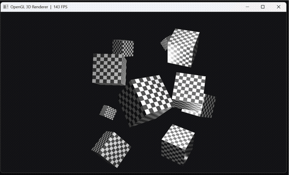

# Real-Time 3D Renderer

A real-time 3D rendering engine built with C++ and OpenGL 3.3, featuring Blinn-Phong lighting, procedural textures, OBJ mesh loading, and interactive camera controls.



## Features

- **Full MVP Pipeline** — model, view, and projection matrix transformations
- **Blinn-Phong Shading** — per-pixel lighting with ambient, diffuse, and specular components
- **Multiple Light Sources** — 1 directional light + 4 point lights with distance attenuation
- **OBJ Mesh Loading** — loads `.obj` files via tinyobjloader with vertex deduplication
- **Procedural Textures** — checkerboard diffuse texture with mipmapping
- **FPS Camera** — WASD movement, mouse look, scroll zoom, Tab to toggle mouse capture
- **Depth Testing & Face Culling** — proper 3D rendering with backface culling
- **Live FPS Counter** — displayed in the window title

## Controls

| Key | Action |
|-----|--------|
| W/A/S/D | Move forward/left/back/right |
| Space / Shift | Move up / down |
| Mouse | Look around |
| Scroll | Zoom in/out |
| Tab | Toggle mouse capture (free cursor for screenshots, etc.) |
| Escape | Exit |

## Build

Requires **CMake 3.20+** and a C++17 compiler. Dependencies (GLFW, GLM) are fetched automatically via CMake. Header-only libraries (stb_image, tinyobjloader) are downloaded at configure time.

```bash
cmake -B build -DCMAKE_BUILD_TYPE=Release
cmake --build build --config Release
```

On Windows with Visual Studio:
```bash
cmake -B build -G "Visual Studio 17 2022" -A x64
cmake --build build --config Release
```

The executable is placed in `build/Release/`. Shaders and assets are copied to the output directory automatically.

## Project Structure

```
├── src/            C++ source files (main, shader, camera, mesh, model, texture)
├── include/        Header files
├── shaders/        GLSL vertex and fragment shaders
├── assets/         Models (.obj) and textures
└── external/       Bundled GLAD OpenGL loader
```

## Tech Stack

- C++17
- OpenGL 3.3 Core Profile
- GLFW 3.4 (windowing + input)
- GLM (math library)
- tinyobjloader (OBJ parsing)
- stb_image (texture loading)
